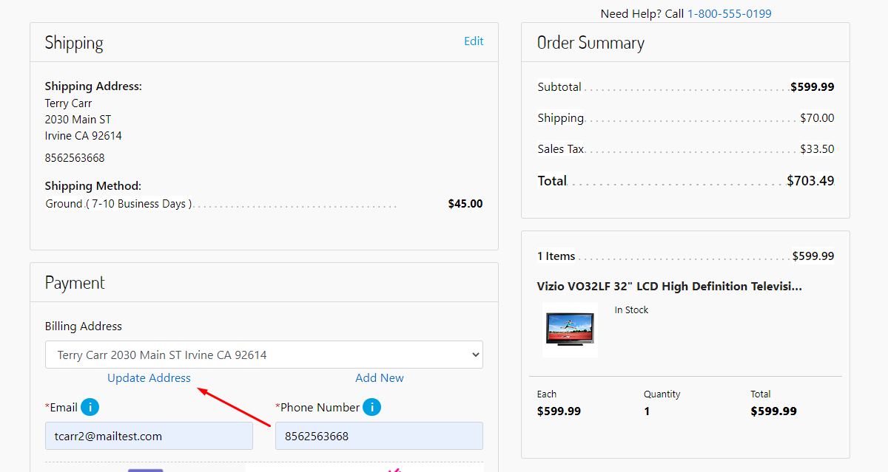
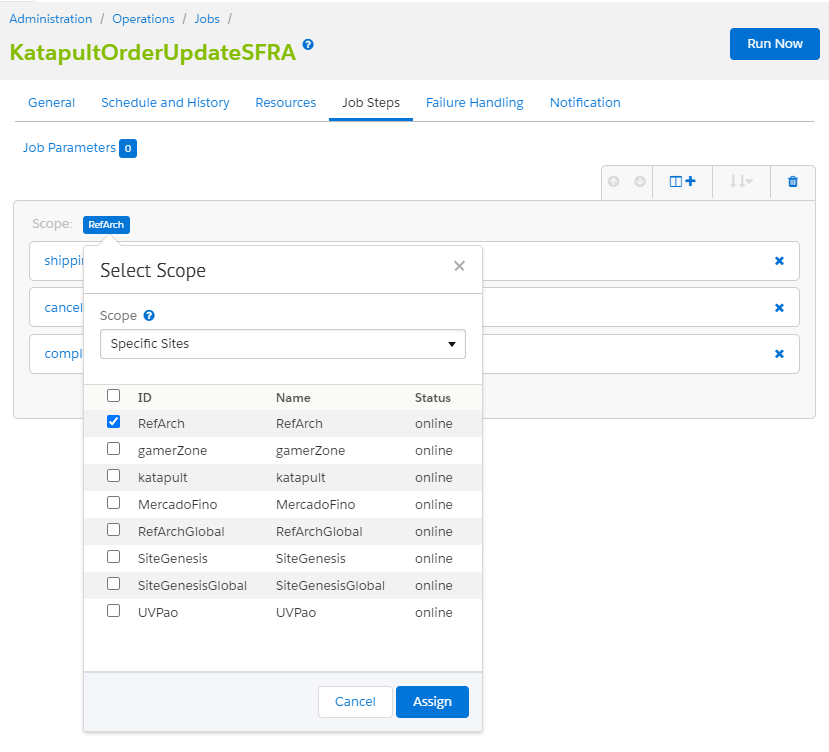
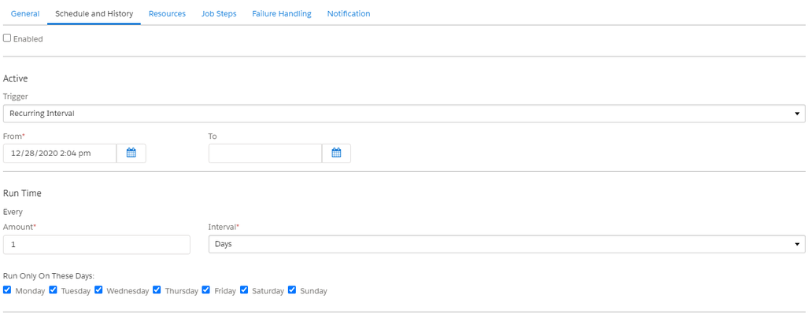
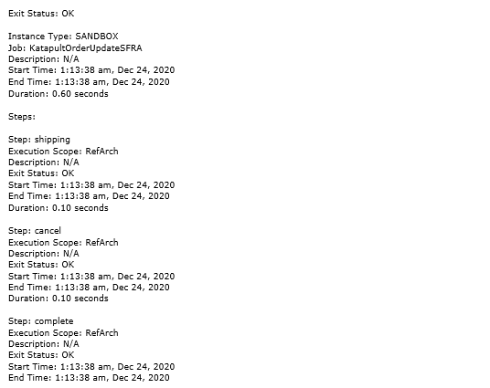

# Katapult Documentation #


This integration is an option of the Katapult payment method for leasable products, which will be available at the payment stage of your checkout. If the end customer has at least one leasable product in the cart, the Katapult payment option will appear so that the buyer can purchase products using the Katapult payment method.

SFRA version tested against version 5.0.1 or later, including: 5.3.0.
Compatibility mode:  From 19.10 to 21.2 tested.
Locales it can work with: Only en_US for this release.

## Implemantation Guides ##

1. [Instalation Guide SFRA Cartridge](#SFRA)

<a name="SFRA"></a>
### Installation Guide SFRA Cartridge ###

#### Import Cartridge ####

- Import **int_katapult_SFRA** into your Workspace inside the **cartridges** folder
- Modify the Site Path in **Business Manager > Administration > Manage Sites > 'Your Site' > Settings**
- Make sure the cartridge name **int_katapult_SFRA:int_katapult_core** appear before any other cartridges


If using Visual Studio code, use the below **dw.json** format to upload the cartridges to the sandbox. Place it at the root of the working directory.

```
{
  "hostname": "your-sandbox-hostname.demandware.net",
  "username": "your_user",
  "password": "your_password",
  "code-version": "version_to_upload"
}
```

#### Set the Cartridge to Compile Front-End ####

- Make sure that the cartridge it's a part of the compilator inside of the **webpack.config.js**


#### Compile Front-End ####

- Run the command **npm run compile:js** to compile front-end scripts.
- Run the command **npm run compile:scss** to compile front-end styles.

#### Import Metadata ####

- Locate folder **katapult_site_import** inside **metadata** folder, change site name if needed inside **sites** folder and compress the **katapult_site_import** folder to **katapult_site_import.zip**

- Log in to the **Business Manager**

- Click **Administration > Site Development > Site Import & Export**

- Use the upload control to browse the **katapult_site_import.zip** file located in the **metadata** folder

- Click **Upload**

- Select the **katapult_site_import.zip** and click Import, press OK on the confirmation alert. Import should complete successfully

- **Note**: A Custom object **katapult_transactions** is used to handle multiple sessions and link Katapult Order to SFCC Order, after that it will be cleaned, but is mandatory to have this CO on your instance to be able to perform Katapult orders.


#### Configure Katapult Services ####

- Make sure that the Katapult services have been imported as part of site import step performed above. Below service configurations should be present in the Services section: **Administration >  Operations >  Services**
- Make sure that the service URL used is one of the following, depending on whether the sandbox is a production or development:
**Sandbox**: https://sandbox.katapult.com
**Live**: https://www.katapult.com

***DO NOT** modify service name(s) of any of the services

Below are the screenshots for reference.

- **Credentials**


- **Profile**


- **Service**


#### Configure Katapult Custom Preferences ####

- Make sure that the **Katapult Custom Preferences** have been imported as part of site import step performed above. Below **Custom Preferences** configurations should be present in **Merchant Tools > Site Preferences > Custom Preferences**

- Select the **Katapult** Group


- Fill the input fields with the information required
  - **KAT_APIToken**: Token to connect with the Katapult API
  - **KAT_environment**: Link for the Katapult environment (Sandbox or Live)</br>
    -**Sandbox** : https://sandbox.katapult.com</br>
    -**Live**: https://www.katapult.com
  - **KAT_minValue**: Minimum value to proceed with Katapult Payment Method
  - **KAT_maxValue**: Maximum value to proceed with Katapult Payment Method
  
  
  
  #### Product Configuration to Use Katapult Payment Method ####
  
- First verify that the product selected is leasable, go to **Business Manager > Merchant Tools >  Products and Catalogs >  Products**


- On the input field search for the ID of the product selected in the Storefront


- Click on the ID


- Click **Lock** to be able to edit the information of the product


- Scroll down to see all the attributes from the product and you will see the Katapult property, for default is **NONE**, the product is **NOT LEASABLE**


- To enable the product as **LEASABLE** change the value to **YES** and press **APPLY** button


#### Placing Order ####

- Once the product selected is set as **Leasable** product, proceed to add it to Cart


- Go to the checkout proccess as a Guest user or login with an account


- Fill the Shipping information and press **Next: Payment** button


- Set the billing information, if is not the same of the Shipping, press **Update Address** and fill the inputs



- Once is set the Payment Information, select the **tab** for the **Katapult Payment Method** and press **Next: Place Order** button


*If all the products selected are not leasable the tab for the Katapult payment method will not be displayed


#### Verify Orders Once Order is Created Using Katapult ####

- In the Business manager go to **Merchant Tools >  Ordering >  Orders**

- Open an order

- Go to the **Payment** tab and verify the Payment Method


- Go to the **Attributes** tab and you will see the Katapult information

***DO NOT** modify any of this information


#### Jobs ####

Our JOBs cover four Methods: **Shipped, Cancel, Cancel Item** and **Completed.**

**Shipped** - Set a delivery date in the Katapult’s management.
**Cancel** - Cancel the entire order.
**Completed** - Mark an order for not to be reprocessed.
**Cancel Item** - Cancel the items individually.

*Your integration must provide the update line items in the SFCC.

You can Update Line Items through:

OCAPI (Open Commerce API)

- Add a Hook to POST order update to the cancel item endpoint. Like below:


XML

- The xml file must have a content like below:


*A test controller was created. In this controller we pass the parameters in the url, where the “CancelItem” is the controller, “cancelItem” is the method, “oid” is the order ID and the “oli” is order line item. See a example url below:
https://www.yoursite.com/CancelItem-cancelItem?oid=00001203&oli=sony-ps3-console*


To avoid change Scope everytime, was created one JOB to SFRA and another to SiteGenesis:


- Go to **Administration > Operations > Jobs**

- Open the Job **katapultOrderUpdateSRFA**


- Verify that the **steps** has selected the **Scope** option for your SFRA site, go to tab **Job Steps**

- Select your RefArch scope and press **Assign**



- Press the button **Run Now** to execute it, this job will update in Katapult’s platform the **Delivery Date**, the orders to **Canceled**, the orders with **Canceled Items** and the **Completed** orders to not be reprocessed.

- You will see that the job was completed at the bottom of the page in the **Schedule and History** Tab, as well as the log file that includes what orders were updated in the Katapult plataform


- This is a row of the log from the order we canceled before in Salesforce, that includes information about the order number and the ID from Katapult's platform


- This is how it looks the order before running the Job in Salesforce


- And this is the status of the order after running the Job


#### Configuring Job Schedules ####

- To configure schedules in Katapult job go to **Administration > Operations > Jobs** and open **katapultOrderUpdateSFRA** Job

- Go to the tab **Schedule and History**


- Configure when will be triggered the job, **Once** or **Recurring**


- If you select **Once** select the date from the option when will be executed the Job


- If you selected **Recurring Interval** select the date from when will starts the job and others parameters like how many times will be ejecuted the Job, this is in the input **Amount, Interval** is to set with minutes, hours, days, weeks or months and for last, the **days** when will be executed the Job



#### Configuring Job Email Notifications ####

- To configure schedules in Katapult job go to **Administration > Operations > Jobs** and open the **katapultOrderUpdateSFRA** Job

- Go to the tab **Notifications**

- Select the events you want notifications, add emails and automatically changes will be saved
 
 
 
 - After run the Job you will receive an email like this
 
 

--------------------------------------------------------------------------------------------------

#### Notes ####
In case your Site Cartridge path is replacing by priority any file used on Katapult cartridges (int_katapult_core, int_katapult_SFRA) make sure that you will copy our code and make it available on the new cartridge in priority Path. Based on SFCC architecture.